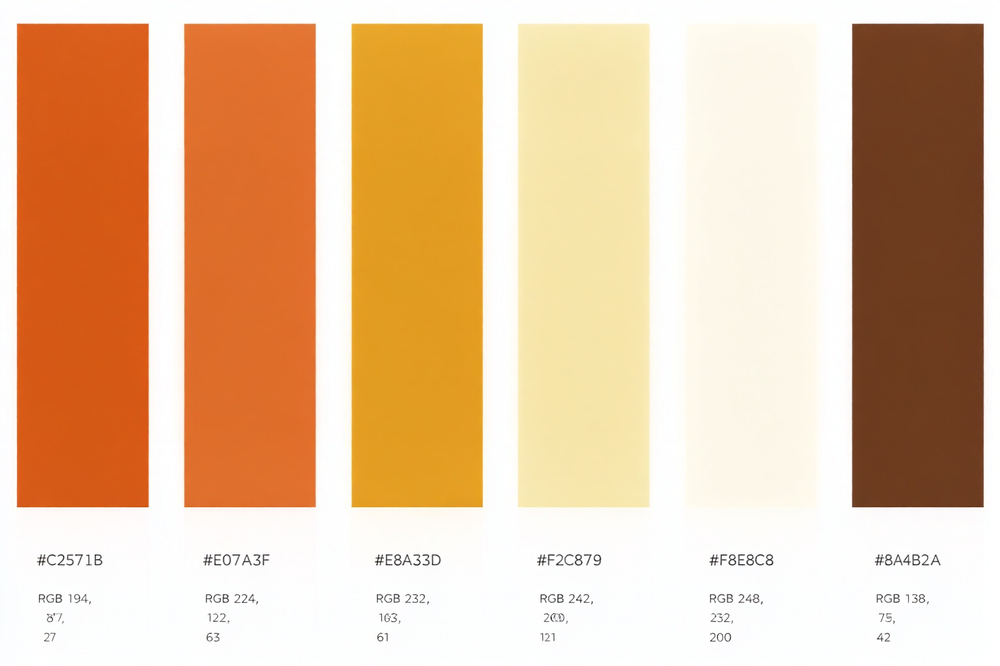

<p align="center">
  
</p>

<h1 align="center">RespondePDF</h1>
# RespondePDF

**RespondePDF** — Extensión de navegador que responde preguntas basadas en tus PDFs usando IA de Gemini. Carga tus documentos, selecciona cualquier texto en cualquier página web y obtén respuestas al instante con su fuente. Despliega el backend en segundos con Docker.

Manifest V3 · Chrome · Edge · Firefox · Docker · Licencia MIT

---

## Índice

- [Descripción](#descripción)
- [Arquitectura](#arquitectura)
- [Estructura del monorepositorio](#estructura-del-monorepositorio)
- [Capturas](#capturas)
- [Paleta de colores](#paleta-de-colores)
- [Para el desarrollador: construir y publicar la imagen](#para-el-desarrollador-construir-y-publicar-la-imagen)
- [API del backend](#api-del-backend)
- [Para el usuario final: desplegar el backend](#para-el-usuario-final-desplegar-el-backend)
- [Obtener la API key gratuita de Gemini](#obtener-la-api-key-gratuita-de-gemini)
- [Instalar la extensión](#instalar-la-extensión)
- [Ejemplo de uso](#ejemplo-de-uso)
- [Privacidad](#privacidad)
- [Limitaciones](#limitaciones)
- [Contributing](#contributing)
- [Issues](#issues)
- [Roadmap](#roadmap)
- [Licencia](#licencia)

---

## Descripción

RespondePDF es una extensión de navegador (Chrome, Edge y Firefox, Manifest V3) que te permite:

- 📚 **Subir varios PDFs** (arrastrar y soltar o selector de archivos). El texto se extrae en tu navegador con pdf.js y se guarda en IndexedDB, por lo que admite documentos grandes.
- 🖱️ **Seleccionar texto en cualquier página** y pulsar el botón flotante «Buscar en RespondePDF» (o usar el menú contextual del clic derecho).
- 💬 **Recibir la respuesta** en una ventana flotante, indicando de qué PDF proviene, la página y una cita literal.
- 🔐 **Usar tu propia API key de Gemini**. El backend es un proxy sin estado: no guarda ningún secreto.

### Flujo de uso

```
Cargar PDFs
     ↓
Seleccionar texto en cualquier web
     ↓
Pulsar "Buscar en RespondePDF"
     ↓
Backend consulta Gemini
     ↓
Respuesta con fuentes y citas
```

## Arquitectura

```
┌───────────────────────── Navegador ─────────────────────────┐
│  Popup ──(pdf.js)──► IndexedDB (texto de los PDFs)          │
│                          │                                  │
│  Content script ──► Service worker ── pregunta + PDFs + key ─┼──► Backend (Docker) ──► API de Gemini
│  (botón flotante)   ◄── respuesta + fuentes ─────────────────┼───◄
└─────────────────────────────────────────────────────────────┘
```

## Estructura del monorepositorio

```
respondepdf/
├── extension/            # Extensión de navegador (frontend puro, sin servidor)
│   ├── manifest.json
│   ├── background.js     # Service worker: llama al backend
│   ├── content/          # Botón flotante y ventana de respuesta
│   ├── popup/            # Subida de PDFs, pregunta directa y ajustes
│   ├── lib/              # IndexedDB, extracción con pdf.js, formato
│   │   └── pdfjs/        # pdf.js de Mozilla incluido localmente
│   └── icons/            # 16, 48 y 128 px
├── backend/              # Proxy Node.js/Express hacia Gemini
│   ├── package.json
│   └── src/
├── docker/
│   ├── Dockerfile        # Solo para CONSTRUIR la imagen
│   └── docker-compose.yml# Para el usuario final: descarga y ejecuta
├── assets/               # Imagen original del icono y paleta de colores
└── scripts/              # Generador de iconos y copia de pdf.js
```

## Capturas

Las capturas son marcadores de posición; añade las imágenes reales en `docs/screenshots/`.

| Gestión de PDFs | Botón flotante | Respuesta con fuentes |
|-----------------|----------------|-----------------------|
| Popup con PDFs  | Botón flotante | Ventana de respuesta  |

## Paleta de colores

<<<<<<< HEAD
| Color | HEX | RGB |
|-------|-----|-----|
| 🟧 Naranja quemado | `#C2571B` | `(194, 87, 27)` |
| 🟠 Naranja calabaza | `#E07A3F` | `(224, 122, 63)` |
| 🟫 Café oscuro | `#5C3A21` | `(92, 58, 33)` |
| 🟨 Caramelo | `#B8860B` | `(184, 134, 11)` |
| ⬜ Crema | `#F5E6D3` | `(245, 230, 211)` |
| ⬛ Café profundo | `#3E2723` | `(62, 39, 35)` |
=======
<p align="center"></p>

| Muestra | Color | HEX | RGB | Uso en la extensión |
| :---: | --- | --- | --- | --- |
|  | Naranja quemado | `#C2571B` | `(194, 87, 27)` | Cabeceras y botones (degradado), títulos, enlaces, errores |
|  | Naranja calabaza | `#E07A3F` | `(224, 122, 63)` | Borde de la zona de carga, barra de progreso, foco |
|  | Mostaza | `#E8A33D` | `(232, 163, 61)` | Pestaña activa, acentos de la lista y de las fuentes, borde del icono |
|  | Amarillo suave | `#F2C879` | `(242, 200, 121)` | Contador, resaltados, fondo de las citas |
|  | Crema | `#F8E8C8` | `(248, 232, 200)` | Fondo del popup y de la ventana flotante, fondo del icono |
|  | Café | `#8A4B2A` | `(138, 75, 42)` | Texto principal, barra de pestañas, final del degradado |

### Icono

El icono parte de [`assets/icon-source.jpg`](assets/icon-source.jpg). El script [`scripts/build-icons.py`](scripts/build-icons.py) lo encuadra, ajusta su fondo al crema de la paleta, mejora el contraste y la nitidez y genera las versiones de 16, 48 y 128 px con esquinas redondeadas.
>>>>>>> dfa372d (Feat: change icon)

## Para el desarrollador: construir y publicar la imagen

El `Dockerfile` (en `docker/`) se usa solo para construir la imagen. El contexto de construcción es la raíz del repositorio.

```bash
# 1. Construir la imagen (desde la raíz del repositorio)
docker build -f docker/Dockerfile -t respondepdf/backend:latest .

# 2. (Opcional) Probarla localmente
docker run --rm -p 3000:3000 respondepdf/backend:latest
curl http://localhost:3000/health        # → {"status":"ok"}

# 3. Iniciar sesión en el registro y subir la imagen
docker login
docker push respondepdf/backend:latest
```

Atajos equivalentes con npm: `npm run docker:build` y `npm run docker:push`.

> **Nota:** Sustituye `respondepdf` por tu usuario u organización de Docker Hub. Para usar GitHub Container Registry, etiqueta la imagen como `ghcr.io/<usuario>/respondepdf-backend:latest`, inicia sesión con `docker login ghcr.io` y actualiza la línea `image:` del `docker-compose.yml`.

Se recomienda publicar también una etiqueta de versión:

```bash
docker tag respondepdf/backend:latest respondepdf/backend:1.0.0
docker push respondepdf/backend:1.0.0
```

Para publicar una imagen multiarquitectura (amd64 + arm64, p. ej. Raspberry Pi):

```bash
docker buildx build --platform linux/amd64,linux/arm64 -f docker/Dockerfile -t respondepdf/backend:latest --push .
```

### Desarrollo local sin Docker

```bash
cd backend
npm install
npm run dev          # http://localhost:3000 con recarga automática
```

### Otras tareas

```bash
npm install            # en la raíz: instala pdfjs-dist
npm run vendor:pdfjs   # actualiza extension/lib/pdfjs desde node_modules
npm run icons          # regenera los iconos 16/48/128 px desde assets/icon-source.jpg (requiere Python 3 + Pillow)
```

## API del backend

| Método | Ruta | Descripción |
|--------|------|-------------|
| GET | `/health` | Devuelve `{ "status": "ok" }`. |
| POST | `/api/query` | Recibe `{ prompt, apiKey, pdfTexts }` y devuelve `{ answer, sources }`. |

**Ejemplo:**

```bash
curl -X POST http://localhost:3000/api/query \
  -H "Content-Type: application/json" \
  -d '{
    "prompt": "¿Cuál es el plazo de entrega?",
    "apiKey": "TU_API_KEY",
    "pdfTexts": [{ "name": "contrato.pdf", "text": "[Página 1]\nEl plazo de entrega es de 30 días." }]
  }'
```

```json
{
  "answer": "El plazo de entrega es de 30 días.",
  "sources": [{ "name": "contrato.pdf", "page": 1, "quote": "El plazo de entrega es de 30 días." }],
  "truncated": false,
  "model": "gemini-2.0-flash"
}
```

| Código | Significado |
|--------|-------------|
| 400 | Faltan `prompt` o `pdfTexts`, JSON inválido o petición rechazada por Gemini. |
| 401 | Falta la API key o Gemini la considera inválida. |
| 413 | El cuerpo supera `BODY_LIMIT`. |
| 429 | Límite por IP (`RATE_LIMIT_PER_MIN`) o cuota de Gemini agotada. |
| 502 / 504 | Error o tiempo de espera agotado al llamar a Gemini. |

## Para el usuario final: desplegar el backend

No necesitas el código fuente, ni `git clone`, ni construir nada. Solo Docker con el plugin Compose.

Crea una carpeta en tu servidor y, dentro, un archivo `docker-compose.yml` con este contenido:

```yaml
services:
  respondepdf-backend:
    image: respondepdf/backend:latest   # ← descarga la imagen ya construida
    ports:
      - "3000:3000"
    environment:
      - GEMINI_MODEL=gemini-2.0-flash
      - PORT=3000
      - RATE_LIMIT_PER_MIN=30
    restart: unless-stopped
```

Arráncalo:

```bash
docker compose up -d
```

Comprueba que funciona:

```bash
curl http://localhost:3000/health
```

Para actualizar a la última versión:

```bash
docker compose pull && docker compose up -d
```

### Variables de entorno

| Variable | Por defecto | Descripción |
|----------|-------------|-------------|
| `GEMINI_MODEL` | `gemini-2.0-flash` | Modelo de Gemini que se usará. |
| `PORT` | `3000` | Puerto interno del contenedor. |
| `RATE_LIMIT_PER_MIN` | `30` | Peticiones por minuto permitidas por IP en `/api/query`. |
| `GEMINI_API_BASE` | `https://generativelanguage.googleapis.com/v1beta` | URL base de la API de Gemini. |
| `MAX_CONTEXT_CHARS` | `800000` | Máximo de caracteres de PDFs enviados a Gemini. |
| `BODY_LIMIT` | `25mb` | Tamaño máximo de la petición. |
| `GEMINI_TIMEOUT_MS` | `60000` | Tiempo máximo de espera de Gemini. |
| `CORS_ORIGINS` | `*` | Orígenes permitidos, separados por comas. |
| `TRUST_PROXY` | `0` | Número de proxies inversos delante (para el límite por IP real). |

> 🔐 **La API key de Gemini NO se configura en el servidor.** Cada usuario introduce su propia key en la extensión, que la envía al backend en cada petición. El backend no la almacena ni la registra.

Si expones el backend a Internet, ponlo detrás de HTTPS (por ejemplo con Caddy, Nginx o Traefik) para que la key viaje cifrada, y define `TRUST_PROXY=1`.

## Obtener la API key gratuita de Gemini

1. Entra en https://aistudio.google.com/apikey con tu cuenta de Google.
2. Pulsa «Create API key» (Crear clave de API) y elige o crea un proyecto.
3. Copia la clave (empieza por `AIza…`).
4. En la extensión, abre la pestaña **Ajustes**, pégala en **API key de Gemini** y pulsa **Guardar**.

El nivel gratuito tiene límites de uso por minuto y por día; si los superas, la extensión mostrará un aviso de límite (429).

## Instalar la extensión

### Chrome

1. Descarga o clona este repositorio (solo necesitas la carpeta `extension/`).
2. Abre `chrome://extensions`.
3. Activa el «Modo de desarrollador» (esquina superior derecha).
4. Haz clic en «Cargar descomprimida».
5. Selecciona la carpeta `/extension`.
6. Fija el icono 📌 de RespondePDF en la barra de herramientas.

### Edge

Igual que en Chrome, pero desde `edge://extensions` → «Modo de desarrollador» → «Cargar desempaquetada» → carpeta `extension`.

### Firefox (121 o superior)

1. Abre `about:debugging#/runtime/this-firefox`.
2. Pulsa «Cargar complemento temporal…» y elige `extension/manifest.json`.
3. En `about:addons` → RespondePDF → Permisos, activa el acceso a los sitios web (en Manifest V3 Firefox los deja como opcionales).

### Primera configuración

En el popup → **Ajustes**:

- **URL del backend:** `http://localhost:3000` por defecto, o la URL de tu servidor (p. ej. `https://pdf.midominio.com`). Pulsa **Probar** para verificar la conexión (el punto de la cabecera se pone verde).
- **API key de Gemini:** la que obtuviste en el paso anterior.

## Ejemplo de uso

1. Abre el popup de RespondePDF y arrastra, por ejemplo, `reglamento-2026.pdf` y `contrato-servicios.pdf`.
2. Espera a que la barra de progreso termine: verás ambos PDFs en la lista con su número de páginas. Desmarca cualquiera que no quieras consultar.
3. En cualquier página web (un correo, un foro, un documento…), selecciona un texto como:

   > ¿Cuántos días de vacaciones corresponden al primer año?

4. Pulsa el botón flotante «Buscar en RespondePDF» (o clic derecho → Buscar en RespondePDF).
5. Aparece una ventana flotante (que puedes arrastrar) con:
   - La respuesta generada a partir de tus PDFs.
   - Las fuentes: 📄 `reglamento-2026.pdf` · pág. 12 y una cita literal del fragmento usado.

También puedes escribir la pregunta directamente en la pestaña **Preguntar** del popup.

## Privacidad

- Los PDFs se procesan localmente en tu navegador; solo se envía el texto extraído a tu backend en el momento de preguntar.
- El backend reenvía el texto a Gemini y no guarda nada en disco.
- Tu API key se guarda en `chrome.storage.local` de tu navegador.

## Limitaciones

- Los PDFs escaneados (imágenes sin capa de texto) no tienen texto extraíble; sería necesario aplicarles OCR previamente.
- Si el total de texto supera `MAX_CONTEXT_CHARS`, cada PDF se recorta proporcionalmente y la respuesta lo indica.
- Mientras se procesa un PDF muy grande, mantén el popup abierto (cerrarlo interrumpe la extracción).

## Contributing

Las contribuciones son bienvenidas.

Si quieres mejorar RespondePDF:

1. Haz un fork del repositorio.
2. Crea una rama de características:

   ```bash
   git checkout -b feature/mi-mejora
   ```

3. Haz tus cambios y confírmalos:

   ```bash
   git commit -m "feat: añadir mi mejora"
   ```

4. Sube tu rama:

   ```bash
   git push origin feature/mi-mejora
   ```

5. Abre un Pull Request.

Mantén el código, nombres de clases, variables, métodos, comentarios y documentación técnica en inglés.

## Issues

Si encuentras un bug o tienes una solicitud de funcionalidad, abre un issue en el repositorio de GitHub con:

- Una descripción clara.
- Pasos para reproducir el problema.
- Comportamiento esperado.
- Comportamiento actual.
- Capturas de pantalla o logs cuando sea relevante.

## Roadmap

- [ ] Soporte para OCR en PDFs escaneados
- [ ] Publicación en Chrome Web Store
- [ ] CI/CD con GitHub Actions
- [ ] Exportar respuestas a PDF
- [ ] Historial de preguntas y respuestas
- [ ] Soporte multi-idioma en la interfaz
- [ ] Modo oscuro

## Licencia

Distribuido bajo la licencia MIT. Consulta `LICENSE`.

`pdf.js` de Mozilla se incluye en `extension/lib/pdfjs/` bajo la licencia Apache 2.0 (ver `extension/lib/pdfjs/LICENSE`).

---

💙 **RespondePDF** — Hecho para que leer tus documentos sea más rápido e inteligente.

Si te resulta útil, considera darle una ⭐ al repositorio.

